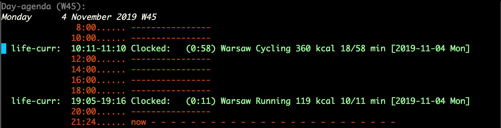

# Send your Garmin activities to OrgMode

First get this script [garminexport](https://github.com/petergardfjall/garminexport) and download activities:

    garminexport$ git:(master) ✗ ./garminbackup.py mag_dex@o2.pl --password XXXXXXXXXXXXXXXXXXX
    2019-10-19 10:54:02,361 [INFO] backing up formats: json_summary, json_details, gpx, tcx, fit
    2019-10-19 10:54:02,362 [INFO] authenticating user ...
    2019-10-19 10:54:03,545 [INFO] claiming auth ticket ...
    2019-10-19 10:54:06,929 [INFO] scanning activities for mag_dex@o2.pl ...
    2019-10-19 10:54:06,929 [INFO] {list_activities}: attempt 1 ...
    2019-10-19 10:54:40,815 [INFO] account has a total of 1739 activities
    2019-10-19 10:54:41,486 [INFO] ./activities contains 1738 backed up activities
    2019-10-19 10:54:41,486 [INFO] activities that aren't backed up: 1
    2019-10-19 10:54:41,486 [INFO] backing up activity 4170666136 from 2019-10-18 15:49:20+00:00 (1 out of 1) ...
    2019-10-19 10:54:41,486 [INFO] {get_activity_summary}: attempt 1 ...
    2019-10-19 10:54:41,739 [INFO] {get_activity_details}: attempt 1 ...
    2019-10-19 10:54:42,217 [INFO] {get_activity_gpx}: attempt 1 ...
    2019-10-19 10:54:42,996 [INFO] {get_activity_tcx}: attempt 1 ...
    2019-10-19 10:54:59,269 [INFO] {get_activity_fit}: attempt 1 ...

then run the script garmin2orgmode.py for the activities folder created by garminbackup.py to generate a log that you can copy paste to your OrgMode (this will be automatized soon)

    (base) [mm] garmin2calendar$ git:(master) ✗ ./garmin2orgmode.py activites/2019-11-*
    *** Warsaw Running 267 kcal 39/40 min
     :LOGBOOK:
      CLOCK: [2019-11-03 Sun 19:36]--[2019-11-03 Sun 20:16] => 0:40
     :END:
    *** Warsaw Cycling 360 kcal 18/58 min
     :LOGBOOK:
      CLOCK: [2019-11-04 Mon 10:11]--[2019-11-04 Mon 11:10] => 0:58
     :END:
    *** Warsaw Running 119 kcal 10/11 min
     :LOGBOOK:
      CLOCK: [2019-11-04 Mon 19:05]--[2019-11-04 Mon 19:16] => 0:11
     :END:
    *** Warsaw Running 267 kcal 39/40 min
     :LOGBOOK:
      CLOCK: [2019-11-03 Sun 19:36]--[2019-11-03 Sun 20:16] => 0:40
     :END:
    *** Warsaw Cycling 360 kcal 18/58 min
     :LOGBOOK:
      CLOCK: [2019-11-04 Mon 10:11]--[2019-11-04 Mon 11:10] => 0:58
     :END:
    *** Warsaw Running 119 kcal 10/11 min
     :LOGBOOK:
      CLOCK: [2019-11-04 Mon 19:05]--[2019-11-04 Mon 19:16] => 0:11
     :END:

The log file will be created so the save activities will not be uploaded more times.

TODO
------------------------------------------

- right now you have to copy-paste OrgMode entries from the terminal, this should be automatized soon

Requirements
------------------------------------------

[garminexport](https://github.com/petergardfjall/garminexport)

